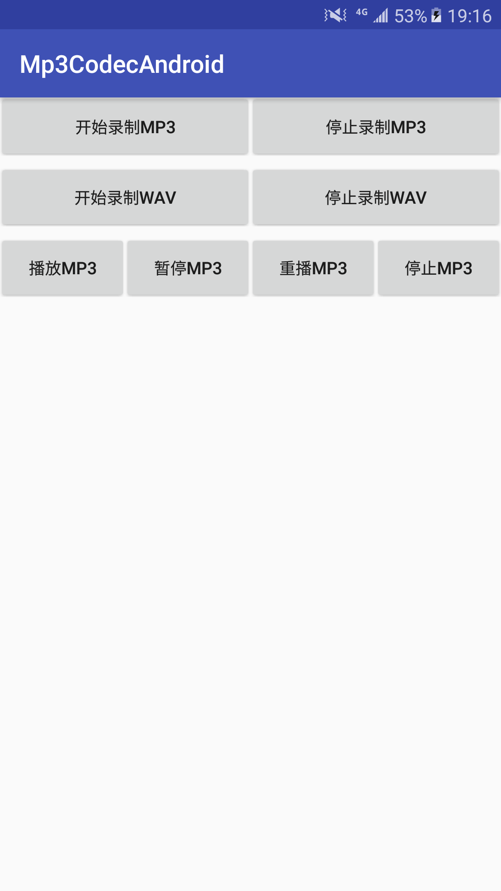

如果您觉得该项目对您有用，请扫描以下二维码打赏1元，多多支持 \

本工程包含三部分 \
1 MP3格式录制模块 \
   AudioRecord采集PCM音频数据，使用libmp3lame库编码成MP3

2 WAV格式录制模块 \
   AudioRecord采集PCM音频数据，封装为WAV格式文件

2 MP3解码模块 \
  Android的Audiotrack只能播放原始PCM音频，使用Libmad库来对mp3文件解码出PCM数据，再送给Audiotrack播放即可。

 
编译环境和步骤 \
1 下载安装android-ndk-r17

2 cd jni/ \
  ndk-build clean \ 
  ndk-build 生成so

3 AS编译运行 \
   录制的MP3文件或WAV文件在SD卡audio_dir目录中
   
4 软件运行截图 \
  

